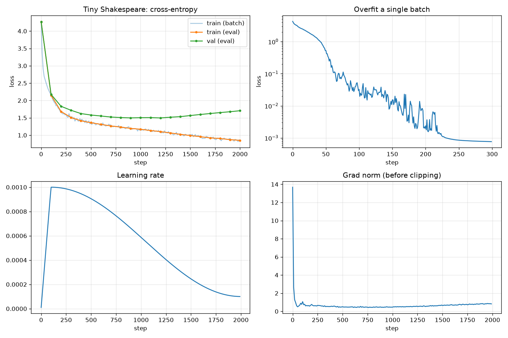

# ДЗ 1. Llama 3 с нуля

Архитектура Llama 3, написанная на PyTorch, и базовый цикл обучения на конечном датасете, чтобы проверить, что модель учится. Датасет: Tiny Shakespeare (около 1,1 млн символов).

## Файлы

| Файл | Что внутри |
|---|---|
| `model.py` | модель: `LlamaConfig`, RMSNorm, RoPE, GQA, SwiGLU, блок трансформера, `Llama` |
| `train.py` | всё остальное: загрузка данных, токенизатор, проверки модели, цикл обучения, логирование, графики, генерация |
| `config.json` | конфиг модели (`model`) и обучения (`train`) |
| `pyproject.toml`, `uv.lock` | зависимости (uv) |

## Запуск

```bash
uv sync
uv run train.py
uv run tensorboard --logdir outputs/tensorboard
```

`train.py` сам скачает датасет в `data/`, если его там нет. Устройство выбирается автоматически: CUDA, затем MPS, затем CPU.

## Архитектура

Модель повторяет Llama 3 из референсного кода Meta, только меньше:

- Эмбеддинги токенов. Позиционных эмбеддингов нет, позицию кодирует RoPE.
- Блок трансформера в pre-norm варианте: `x = x + Attn(RMSNorm(x))`, затем `x = x + FFN(RMSNorm(x))`.
- RMSNorm с обучаемым весом, eps = 1e-5, нормировка считается в float32.
- RoPE с theta = 500 000, как в Llama 3. Поворачиваются соседние пары координат (x0, x1), (x2, x3) и т.д., так же, как в коде Meta. Синусы и косинусы считаются один раз и хранятся в буфере.
- Grouped-Query Attention: 8 голов для Q и 2 для K/V, на каждую K/V голову приходится 4 query-головы. K и V размножаются через `repeat_interleave`, потом вызывается `F.scaled_dot_product_attention` с `is_causal=True`.
- FFN на SwiGLU: `w2(silu(w1(x)) * w3(x))`. Скрытый размер считается по формуле Llama: берём `int(8·dim/3)`, умножаем на `ffn_dim_multiplier` = 1,3 и округляем вверх до кратного `multiple_of`. Для dim = 256 выходит 896.
- Финальный RMSNorm и выходная голова `output`, не связанная с матрицей эмбеддингов (в Llama 3 8B они тоже раздельные).
- Веса инициализируются из нормального распределения со std = 0,02. У выходных проекций residual-веток (`wo`, `w2`) std дополнительно делится на `sqrt(2·n_layers)`.

Bias нет ни в одном линейном слое. KV-кэша тоже нет, в этом задании он пока не требуется. `generate` на каждом шаге заново прогоняет весь контекст.

Токенизатор посимвольный, словарь из 65 символов. Родной BPE-токенизатор Llama 3 на 128k токенов для такого маленького датасета избыточен.

### Размер модели

| Параметр | Значение |
|---|---|
| `dim` | 256 |
| `n_layers` | 6 |
| `n_heads` / `n_kv_heads` | 8 / 2 |
| `head_dim` | 32 |
| скрытый размер FFN | 896 |
| `max_seq_len` | 256 |
| `vocab_size` | 65 |
| параметров всего | 5,15 млн |

## Обучение

AdamW (betas 0,9 / 0,95, weight decay 0,1, на веса RMSNorm не действует), 100 шагов линейного warmup до lr = 1e-3, дальше косинус до 1e-4. Градиенты клипаются по норме 1,0. Батч 32 последовательности по 256 символов, 2000 шагов. Датасет разбит 90/10 на train и val. Каждые 100 шагов loss усредняется по 20 случайным батчам из каждой части.

Перед основным обучением `train.py` делает две проверки:

1. Меняет последний токен во входе и смотрит, что логиты на предыдущих позициях не изменились. Если изменились, маска внимания пропускает будущие токены.
2. Обучает отдельную свежую модель 300 шагов на одном фиксированном батче. Если модель и цикл обучения собраны правильно, она должна этот батч выучить почти идеально.

## Как прошло обучение



Переобучение на одном батче сработало: loss упал с 4,27 до 0,0008 за 300 шагов. Forward, backward и оптимизатор работают, и ёмкости модели хватает, чтобы запомнить батч.

Основное обучение стартовало с loss 4,27. Это близко к ln(65) ≈ 4,17: в начале модель предсказывает почти равномерно, как и должна при такой инициализации.

| Шаг | train loss | val loss |
|---:|---:|---:|
| 0 | 4,270 | 4,268 |
| 200 | 1,684 | 1,833 |
| 500 | 1,360 | 1,581 |
| 900 | 1,196 | 1,498 |
| 1200 | 1,103 | 1,497 |
| 1500 | 0,990 | 1,566 |
| 1999 | 0,851 | 1,705 |

Лучший val loss (1,497) был около шагов 900–1200. После этого train продолжает падать, а val растёт: модель начинает переобучаться. Это ожидаемо: 2000 шагов × 32 × 256 ≈ 16 млн токенов, то есть примерно 16 проходов по обучающей части (около 1 млн символов), а модель в 5 млн параметров успевает её запомнить. Если нужна лучшая модель, а не проверка обучаемости, хватило бы ~1000 шагов. Ещё можно добавить dropout или взять больше данных.

Норма градиента на первом шаге около 13,7, к 40-му шагу падает ниже 1, а после 150-го держится в диапазоне 0,43–0,87. Под конец обучения она немного растёт вместе с переобучением. NaN в loss не было.

Пример генерации после обучения (`temperature=0.8`, `top_k=20`, затравка `ROMEO:`):

```
ROMEO:
Then by the form, I would not be a kind
To be a swordness of my kin, some men shall,
His country is to fearful for these in woe.

BALTHASAR:
I am Poat, no more and some worthiest for ruth.

VIRGILIA:
Madam, I'll no good should have a castle again.
```

Модель выучила формат пьесы (имя персонажа, двоеточие, реплика), имена из текста и в основном настоящие английские слова. Смысла в репликах, конечно, нет.

## Где лежат результаты

Всё пишется в `outputs/` (путь меняется флагом `--out`):

| Путь | Что это |
|---|---|
| `outputs/training.png` | графики: loss train/val, переобучение на одном батче, learning rate, норма градиента |
| `outputs/tensorboard/` | логи TensorBoard: те же метрики, плюс конфиг и пример генерации во вкладке Text |
| `outputs/history.json` | все залогированные значения в JSON |
| `outputs/model.pt` | веса модели после последнего шага и конфиг (`{"model": state_dict, "config": ...}`) |
| `outputs/sample.txt` | сгенерированный текст |
| `data/tinyshakespeare.txt` | скачанный датасет |

`model.pt` сохраняется после шага 1999, а не в точке с лучшим val loss. В репозиторий он не входит (19,7 МБ), появляется после запуска `train.py`. Датасет тоже скачивается при запуске.
